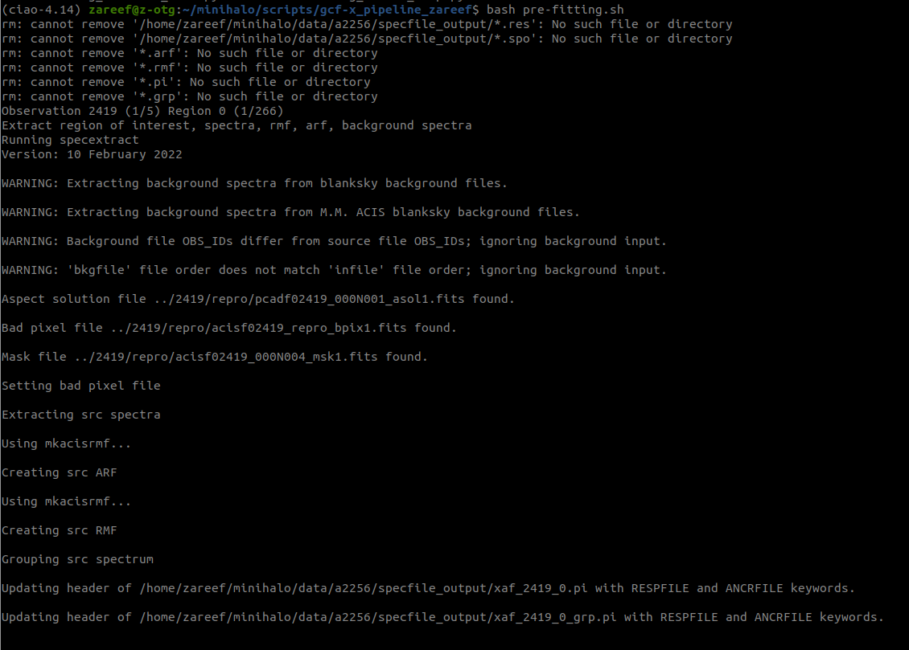
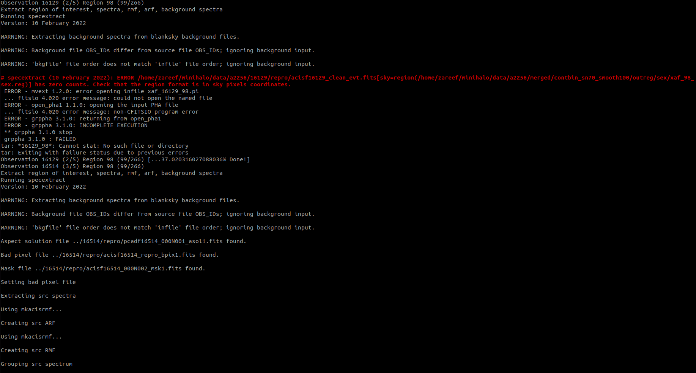
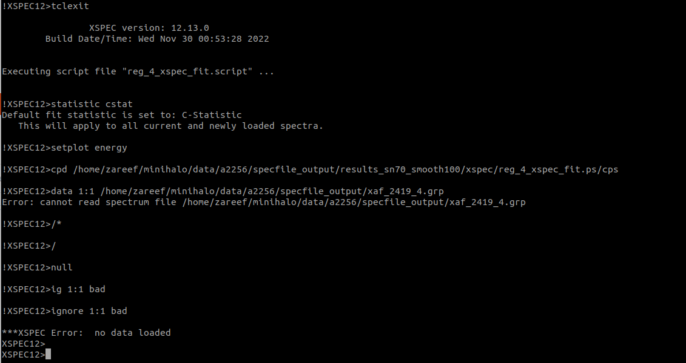
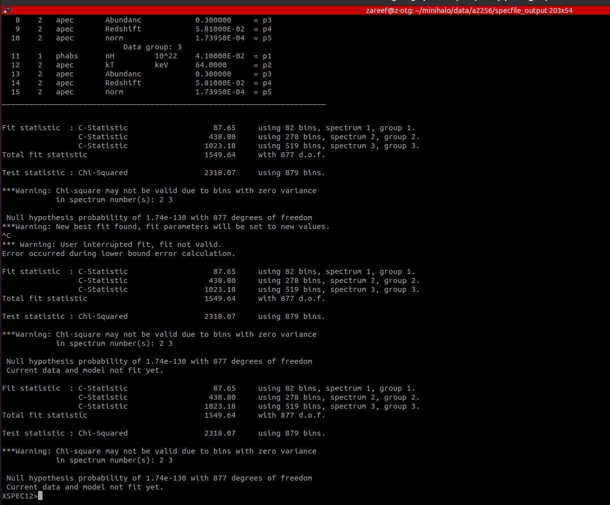

-----------------------
### Introduction
------------------

Pipeline to create x-ray temeprature maps, pressure maps, surface brightness maps, and density maps of  galaxy clusters from [Chandra Data Archive.](https://cda.harvard.edu/chaser/)


This pipeline is based on a [pipeline](https://github.com/jpbreuer/Chandra_pipeline) created by [Jean-Paul Breuer](http://jpbreuer.com/aboutme.html)

Special thanks to,

Dr. Khan M B Asad\
Assistant Professor
Independent University, Bangladesh

Jean-Paul Breuer\
Masaryk University, Czech Republic

-----------------------
### Environment setup
-----------------------

Platform Support: Tested on Ubuntu 20.04.5 lts, Ubuntu 20.04.3 LTS server.


**1. Install Anaconda distribution.**

Follow the [Anaconda Installation page](https://docs.anaconda.com/anaconda/install/linux/) for installation.

**2. Installing CIAO with conda.**

- Run the following command in the terminal to install ciao, caldb and some associated software in a conda environment named “ciao-4.14” or anything you like.
```
conda create -n ciao-4.14 -c https://cxc.cfa.harvard.edu/conda/ciao -c conda-forge ciao sherpa ds9 ciao-contrib caldb marx jupyter jupyterlab numpy matplotlib astropy scipy scikit-learn pandas seaborn
```
- CALDB, acis_bkgrnd and hrc_bkgrnd file download might fail because of  ```CondaHTTPError: HTTP 000 CONNECTION FAILED for url``` error or slow internet connection. If this happens remove caldb from CIAO installation command and follow the [Alternative download instructions](https://cxc.cfa.harvard.edu/ciao/threads/ciao_install_conda/index.html#alt_download)

- Reference: [Installing CIAO with conda page](https://cxc.cfa.harvard.edu/ciao/threads/ciao_install_conda/)


**3. Download and install HEASOFT Software.**

- Go to the [HEASOFT installation page](https://heasarc.gsfc.nasa.gov/lheasoft/download.html)

- Select "Source Code" and select "PC - Linux - Ubuntu" from checkbox in STEP 1.

- Select all in STEP 2 and click submit.

- unzip or extract the .tar.gz file and follow the [INSTALLATION](https://heasarc.gsfc.nasa.gov/lheasoft/ubuntu.html) process to install HEASOFT.

- To make HEASOFT initialization easy I have created the following alias:

  In the terminal type the following:
  ```
  nano ~/.bashrc
  ```
  Paste the following command (replace the "heasoft-6.30.1" with downloaded heasoft folder name and "PLATFORM" with machine's architecture):

  ```
  alias heainit="export HEADAS=/path/to/your/installed/heasoft-6.30.1/(PLATFORM); . $HEADAS/headas-init.sh"
  ```
  To get the PLATFORM name:\
      Go inside the heasoft directory\
      Will see a folder named like "x86_64-pc-linux-gnu-libc2.31"\
      Copy the folder name\
      Replace PLATFORM placeholder with "x86_64-pc-linux-gnu-libc2.31"


  Finale Initialization alias will look something like this:
  ```
  alias heainit="export HEADAS=/home/usr/software/heasoft-6.30.1/x86_64-pc-linux-gnu-libc2.31; . $HEADAS/headas-init.sh"
  ```
  save the ~/.bashrc.\
  run ```source ~/.bashrc```\
  Type ```heainit``` to initiate HEASOFT whenever needed.


**4. Install CFITSIO**

- Download CFITSIO from [here](https://heasarc.gsfc.nasa.gov/docs/software/fitsio/fitsio.html)

- Follow [this](https://www.gnu.org/software/gnuastro/manual/html_node/CFITSIO.html) instructions.


**For server**
Unable to build and install CFITSIO from source without admin access. Will solve in the future update.


**5. Download and install Contour binning and accumulative smoothing software.**

- Open terminal and run the following:
```
git clone https://github.com/jeremysanders/contbin
```
- Go to the downloaded folder directory.
```
cd ~/Downloads/contbin
```
- Build:
```
make
```
- Copy the built program:
```
sudo make install 
```


**For server**
- Open terminal and run the following:
```
git clone https://github.com/jeremysanders/contbin
```

- Create a ```local/bin``` directory in home directory:
```
mkdir -p local/bin
```

- Go to the ```contbin``` folder
- Open MakeFile
```
nano MakeFile
```
- Set the ```bindir``` varaible path as the created local/bin path (e.g ```/home/usr/local/bin```)

- Build:
```
make
```
- Copy the built program:
```
sudo make install 
```

To learn more about [contbin](https://github.com/jeremysanders/contbin)

**6. OPTIONAL: Installing GNU parallel shell tool.(Not used)**

Run the following:
```
conda install -c conda-forge parallel
```

Reference:

[GNU parallel official page](https://www.gnu.org/software/parallel/)

[Anaconda parallel package link](https://anaconda.org/conda-forge/parallel) 


**7. OPTIONAL: Install SPEX software package.(Not used)**

Follow the SPEX installation guide from [here](https://spex-xray.github.io/spex-help/getstarted/install.html).

-----------------------
### Generating maps.
-----------------------
To download ChandraCluster_mapPipeline, simply run ```git clone https://github.com/ZareefJafar/ChandraCluster_mapPipeline.git```

Go to the folder ```cd ~/ChandraCluster_mapPipeline```.

There are several python scripts (.py files). Running each script will generate a bash script (.sh file). 

Let's start!!!

**Step 0: Creating directories**
- Everything will run on ```conda``` environment. So, activate it first.
```
conda activate ciao-4.14
```
- Run ```directory.py```. Enter the instructed informations. 
```
python directory.py
```

**Step 1: Run PreProcessing_download_data.py**
```
python PreProcessing_download_data.py
```
```
bash preprocessing.sh
```

**Step 2: Run PreProcessing_reprocess_data.py**
```
python PreProcessing_reprocess_data.py
```
```
bash preprocessing.sh
```

Issues and solution:\
[pget_error](https://cxc.cfa.harvard.edu/ciao/faq/pget_error.html)

**Step 3: Run PreProcessing_flare_filter.py**

```
python PreProcessing_flare_filter.py
```
```
bash preprocessing.sh
```

**Step 4: Run PreProcessing_merge_data.py**
```
python PreProcessing_merge_data.py
```
```
bash preprocessing.sh
```

**Step 5: Run PreProcessing_merge_data_flux.py**
```
python PreProcessing_merge_data_flux.py
```

**Step 6: Removing point source from merged image**

- Open ```broad_thresh.img``` with ds9. This file should be located inside ```merged``` folder inside cluster data folder.

```
ds9 ~/[data_dir]/[cluster_name]/merged/broad_thresh.img
```
- We need to create 3 region files from ```broad_thresh.img``` file.\
```src_0.5-7-nps-noem.reg```:\
A region file that contains all cluster emission (eg. a large circle around the cluster that includes the extended emission, 
which will be removed and used for the deflaring/high energy rescaling). This would include areas such as the peak of cluster                             emission as these regions may contain high energy events you want to consider in this analysis.\
```broad_src_0.5-7-pointsources.reg```:\
A region file that contains all of the pointsources. These are typically foreground point sources one does not want                                       to consider when analyzing the cluster.\
```square.reg```:   
This will eventually crop out all things outside of the region of interest. 

Region file format:```Region - ciao```,```Coordinate System - wcs```\
Save location: ```~/[data_dir]/[cluster_name]/regionfiles```.


- Run ```PreProcessing_source_crop.py```
```
python PreProcessing_source_crop.py
```
- Run generated ```preprocessing.sh```
```
bash preprocessing.sh
```

**Step 7: Run Preliminary_Products_contourbin.py**
```
python Preliminary_Products_contourbin.py
```
```
bash preliminary_products.sh
```

**Step 8: Converting region file coordinate system syntax**

- Convert region file coordinate system syntax
```
python RegCoordChange.py
```
```
bash regcoordchange.sh
```

**Step 9: Pre fitting**

Running this will take a long time depending on the data. To run this in a remote server or another computer system follow the instruction ```FOR REMOTE MACHINE```. Future works includes adding CPU/GPU parallel processing. 

- OPTIONAL: FOR REMOTE MACHINE.
Transfer the data file and script file to the remote server. Make sure the remote server has ciao and heasoft installed. Then run ```change_machine.py```.
```
python change_machine.py
```
input: [new_data_dir]/[new_data_subDir]\
Continue running remaining steps from the remote server. \
```cd /home/[usr]/[new_script_dir]/[new_script_subDir]/ChandraCluster_mapPipeline```.
- Run Processing_pre_fitting.py
```
python Processing_pre_fitting.py
```
- Initialize ```heasoft``` using alias we created previously.

```
heainit
```

- OPTIONAL STEP: In case of```bash: /headas-init.sh: No such file or directory``` error message run the following commands sequentially
```
source ~/.bashrc
```
```
conda activate ciao-4.14
```
```
heainit
```

- Run generated ```pre-fitting.sh```
```
bash pre-fitting.sh
```
- While running ```pre-fitting``` you may see following Warnings related to ```OBS_ID and background files```. Ignore it.


- May encounter ```specextract zero count error```. Ignore it for now.


will fix both in the next update.

**Step 10: Processing_xspecfitting.py**
- Run Processing_xspecfitting.py
```
python Processing_xspecfitting.py
```
- Go to ```specfile_output``` folder. You will find a file named```xspecfitting.sh```. 
```
cd ~/[data_dir]/[cluster_name]/specfile_output
```
- run ```xspecfitting.sh```
```
bash xspecfitting.sh
```
- If you face following error just type ```exit``` and press Enter.



- This particular error will run endlessly. Just press ```Ctrl+C``` to stop it and type ```exit``` to continue.   



- Return to the python script folder and start following from step 11.
```
cd ~/ChandraCluster_mapPipeline
```

**Step 11: Run ParseOutput_xspec.py**
```
python ParseOutput_xspec.py
```
**Step 12: Run cleanup.py**
```
python cleanup.py
```
**Step 13: Finale step, creating maps**

- Run ```pipeline_maps.py```
```
python pipeline_maps.py
```
All the maps will be saved in the maps folder of the data folder. ```~/[data_dir]/[cluster_name]/maps```

DONE!!!!!!!!

-----------------------
### Sample data, bash scripts and paper.
-----------------------

- All the generated data products including generated bash script and maps of some galaxy clusters using the pipeline: [drive](https://drive.google.com/drive/folders/16Sxy-VS4MbmElKVLhYDZdtxcmunzIFm1?usp=share_link)

- This [paper](https://arxiv.org/pdf/2005.10263.pdf) by J. P. Breuer discusses about image analysis of a2256 cluster.

-----------------------
### Additional Resources: 
-----------------------

Some resources which hepled me to work with this pipeline and also my ongoing work on detecting cold fronts from galaxy clusters with potential minihalo.  
- [Galaxy Clusters, ARGI](http://abekta.iub.edu.bd/rs/gc)
- [Asad, MSc thesis](https://drive.google.com/file/d/1RyDp2HOEMch7D02P2CQ9kiDz8j-O6hpf/view)
- [A Brief Intro to the Chandra Mission by Jonathan McDowell](https://cxc.harvard.edu/ciao/workshop/jan21/jcm.ws21.pdf)
- [An X-ray Data Primer](https://cxc.harvard.edu/cdo/xray_primer.pdf)
- [X-ray spectroscopy of galaxy clusters: studying astrophysical processes in the largest celestial laboratories](https://link.springer.com/article/10.1007/s00159-009-0023-3)
- [Occurrence of Radio Minihalos in a Mass-limited Sample of Galaxy Clusters](https://iopscience.iop.org/article/10.3847/1538-4357/aa7069/meta)
- [Expanding the Sample of Radio Minihalos in Galaxy Clusters](https://iopscience.iop.org/article/10.3847/1538-4357/ab29f1/meta)
- [Diffuse Radio Emission from Galaxy Clusters](https://link.springer.com/article/10.1007/s11214-019-0584-z)


